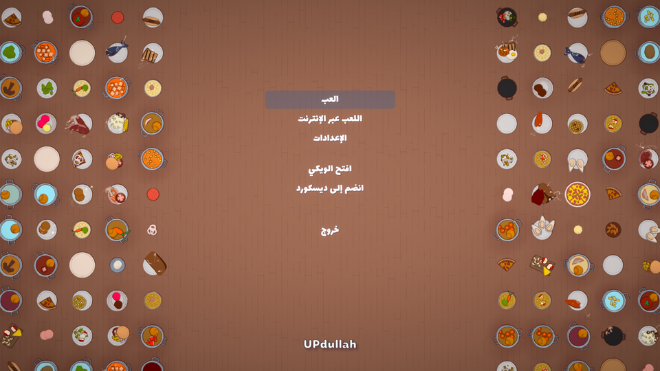
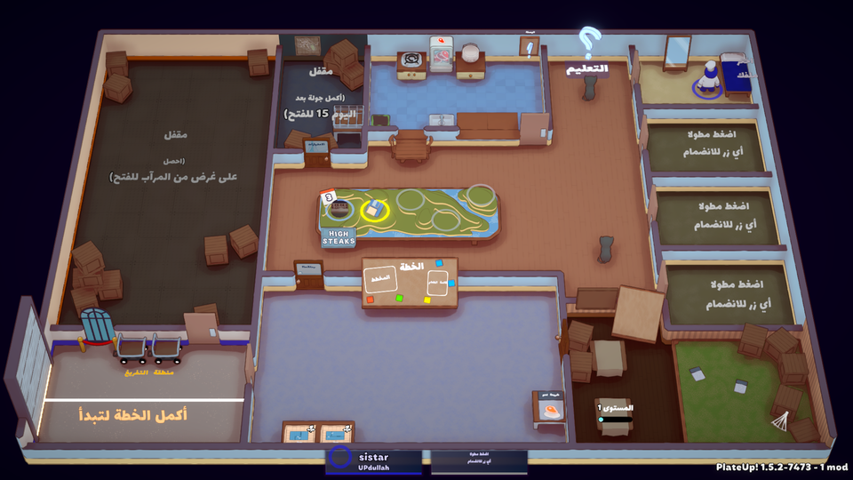

<div dir="rtl">

# ‏PlateUp!‎ بالعربية

تعريب كامل للعبة [‏PlateUp!‎](https://store.steampowered.com/app/1599600/) على هيئة إضافة.
لا يُعدَّل أي ملف من ملفات اللعبة: إزالة الإضافة تُعيدها إلى الإنجليزية تمامًا كما كانت.

</div>





<div dir="rtl">

## التنزيل

نزّل أحدث ملف من صفحة **[الإصدارات](../../releases)**، ثم فُكّ ضغطه.

## التثبيت على ويندوز

انقر نقرًا مزدوجًا على `install-windows.bat`.

تفتح نافذة صغيرة تعثر على اللعبة وحدها؛ اضغط **تثبيت**. وإن لم تجدها، اضغط **استعراض**
وحدّد المجلد الذي يحتوي على `PlateUp.exe`.

إن ظهرت رسالة عن الصلاحيات، اضغط على الملف بزر الفأرة الأيمن واختر **تشغيل كمسؤول**.

## التثبيت على لينكس

</div>

```bash
./install.sh
```

<div dir="rtl">

ولتحديد مسار اللعبة بنفسك:

</div>

```bash
./install.sh /path/to/PlateUp
```

<div dir="rtl">

## تشغيل التعريب

شغّل اللعبة ← **الإعدادات** ← اختر **العربية** من قائمة اللغات.

## الإزالة

في ويندوز: شغّل `install-windows.bat` واضغط **إزالة**.

وفي لينكس:

</div>

```bash
./install.sh --uninstall
```

<div dir="rtl">

## ما ينبغي معرفته

- **الإنجازات واللعب الجماعي تعمل كالمعتاد.** الشيء الوحيد الذي يتوقف هو تسجيل الجولات في
  قوائم السرعة (speedrun leaderboards)، وهذا شرط تفرضه اللعبة على أي إضافة مهما كانت.
- **ملفات اللعبة لا تُمَس.** كل شيء داخل مجلد واحد اسمه `Mods/PlateUpArabic`، وحذفه وحده
  كافٍ للتراجع عن كل شيء.
- النصوص مكتوبة بلا تشكيل، لأن محرّك النصوص في اللعبة لا يضع الحركات في مواضعها الصحيحة.
- النسخة المدعومة من اللعبة: **1.5.2**. إن حُدِّثت اللعبة وبدا شيء في غير موضعه، أعد التثبيت.

## وجدت خطأً؟

افتح [مشكلة](../../issues) واذكر النص كما ظهر وأين رأيته في اللعبة، وأرفق صورة إن أمكن.

## الخطوط والتراخيص

الخطوط المستخدمة [Lalezar](https://github.com/BornaIz/Lalezar) للعناوين
و[Noto Sans Arabic](https://github.com/notofonts/arabic) لبقية النصوص، وكلاهما برخصة
SIL Open Font License 1.1.

شيفرة المشروع برخصة MIT. هذا عمل غير رسمي من المعجبين، ولا صلة له بمطوّري اللعبة.

## للمساهمين

شرح آلية العمل وبنية المشروع في [docs/internals.md](docs/internals.md)، ودليل المصطلحات
وقواعد الصياغة في [docs/glossary.md](docs/glossary.md).

</div>
